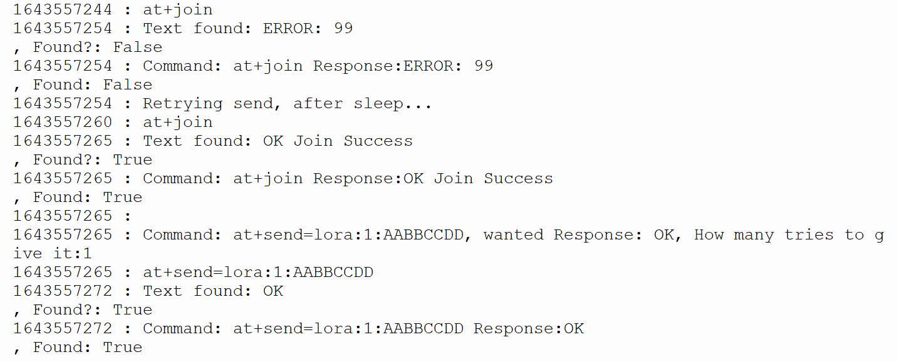
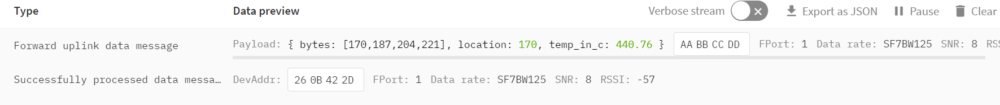

# pylorawan 

Pylorawan is a Micropython wrapper for lorawan devices from RAK Wireless.

Originally tested on a Raspberry PI Pico with a RAK4200(H) Evaluation Board (868MHz) (bought direct from RAK Wireless: https://rakwireless.kckb.st/821e96d1 )

It now also supports the RAK3172 device.

It uses the RAK devices AT commands to join the network and send the data

## How do I use this?

1. Create an account on The Things Network / The Things Stack Community Edition and register your device and create an application
1. Update the `creds_config__example.py` with the keys from your device and The Things Network (TTN)
1. Rename the file `creds_config__example.py` to `creds_config.py`
1. Ensure that you use the right region (I'm in Europe, so I use `EU868`, in the USA you would use: `US915`, in India: `IN865` etc)
1. Connect the Pico and the RAK device. Ensuring that:
    - The Pico UART *Tx* connects to the UART *Rx* on the RAK device 
    - The Pico UART *Rx* connects to the UART *Tx* on the RAK device 
1. Upload the files, `pylorawan.py`, `creds_config.py` and `simple_example_<YOUR_DEVICE>.py` to the Pico using Thonny
1. Open `simple_example.py` in Thonny and hit play. If debug is set to True, you should get debug like this:

And when connected, hopefully a few seconds later, in the TTN console you should see this:

